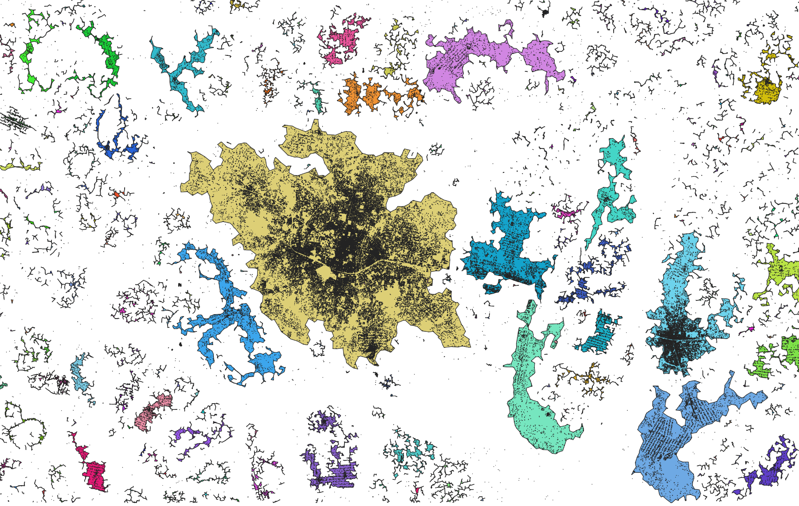

# Africapolis Workflow
The *Africapolis* Workflow clusters and visualizes urban areas from individual building footprint polygons. It is orchestrated with the [Common Workflow Language (CWL)](https://www.commonwl.org/user_guide/), with each stage being a C++ command line program wrapped with CWL. The implementation depends on the [*Fishnet*](https://gitlab2.informatik.uni-wuerzburg.de/descartes/sos/fishnet) framework.



# Installation
All software dependencies are capsulated in a custom [docker image](https://hub.docker.com/r/logru/africapolis) containing the binaries and the GDAL library which is specified in the CWL files. The workflow can be executed with any CWL-Runner, that supports containerized execution. 

 The following example shows how to run the workflow with `cwltool`, providing the workflow's main definition file ([_Africapolis.cwl_](cwl/Africapolis.cwl)) and initializing the workflow's parameters. 
```
cwltool Africapolis.cwl --shapefile <File.shp> --configFile <Config.Json> --partitions <UnsignedInt>
``` 
| Parameter| Info |
|---|---|
| `--shapefile` | Path to vector file (.shp) containing the settlement polygons
| `--configFile` | Path to the workflow's configuration file
| `--partitions` | Number of vertical / horizontal splits applied to the input file for workload distribution

In the configuration file of the workflow the settlement graph construction and clustering can be customized according to local peculiarities. Currently, three cluster modes are supported:
| Algorithm | Info |
|--- | --- |
| `BFS` | Breadth-first search based retrieval of connected components in the settlement subgraph whose edges comply with the `distance-threshold` 
| `DBSCAN` | Density-based clustering retrieving clusters of settlements which are separated by less than `distance-threshold`. Cluster with less then `min-cluster-size` amount of nodes are classified as _noise_.
| `DBSC` | Adoption of `DBSCAN`, applying heuristics-based trimming to the settlement graph in the `beta`-order neighborhood of each settlement. Can combine spatial distance with attribute-based similarity to infer clusters. Currently only `attribute-mapper="AREA"` is supported, which takes the area of the settlement polygons into account. 

Exemplary config file for `DBSCAN` with a threshold of 200m and a minimum of 5 nodes per cluster:
```json
{
    "clustering": {
        "mode": "DBSCAN", # Cluster Algorithm
        "args": {
            "distance-threshold": 200.0, # Clustering threshold in meters
            "min-cluster-size": 5 # Minimum nodes to form a cluster
        }
    },
    "buffer-distance-meters": 200.0, # Graph construction buffer in meters
    "max-neighbors-per-node": 5
}
```
# HPC Deployment
Use the [Africapolis Shellscript](prod/hpc/run-africapolis.sh) to install and run the workflow on a HPC system. You can also do the following steps manually:
### 1. Upload Files
- Upload CWL directory containing the main workflow file `Africapolis.cwl` in the same directory structure as in the repository (packed/single file version does not work with `toil`)
- Upload input files or pull from STAC
- Upload config file(s)
- Store files in [corresponding directory](directory_structure.png)
### 2. Install Toil
- Create python venv
```
module load python
python -m venv ~/africapolis-workflow/venv
```
- Source venv
``` 
source ~/africapolis-workflow/venv/bin/activate
```
- Install via pip
```
pip install toil[cwl]
```
### 3. Execute Workflow
Execute via the `toil-cwl-runner` directly (current directory will be output directory)
```
module load apptainer
source ~/africapolis-workflow/venv/bin/activate
toil-cwl-runner --singularity --batchSystem slurm  ~/africapolis-workflow/cwl/AfricapolisWorkflow.cwl --shapefile <File.shp> --configFile <Config.Json> --partitions <UnsignedInt>
```

# Development
The required binaries of *Africapolis* can be manually install on the system. This can be achieved with the [install](install.sh) script. Make sure that the install prefix location (*$INSTALL_PREFIX*) is referenced in *PATH* (e.g. *usr/local/bin*). 
```shell
./install.sh
```
Additionally, a [CWL Runner](https://www.commonwl.org/implementations/) must be installed to execute the workflow. The reference executor [cwltool](https://cwltool.readthedocs.io/en/latest/cli.html#cwltool) is recommended and can be installed as follows:
```shell
sudo apt-get install cwltool
```
### Running the Workflow
```
cwltool Africapolis.cwl --shapefile <File.shp> --configFile <Config.Json> --partitions <UnsignedInt>
``` 
