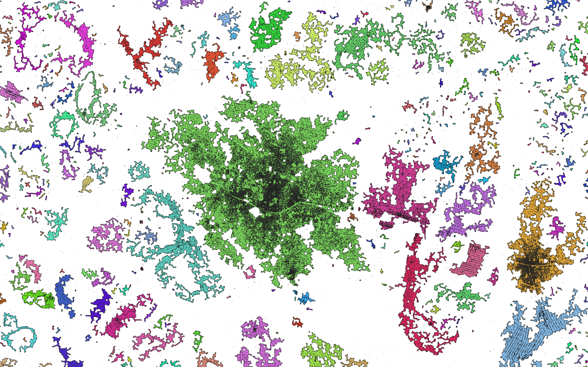

# Africapolis Workflow
The *Africapolis* Workflow clusters and visualizes urban areas from individual building footprint polygons. It is orchestrated with the [Common Workflow Language (CWL)](https://www.commonwl.org/user_guide/), with each stage being a C++ command line program wrapped with CWL. The implementation depends on the [*Fishnet*](https://github.com/LoloGruber/fishnet.git) framework.



# Installation
All software dependencies are capsulated in a custom [docker image](https://hub.docker.com/r/logru/africapolis) containing the binaries and the GDAL library which is specified in the CWL files. The workflow can be executed with any CWL-Runner, that supports containerized execution. 

 The following example shows how to run the workflow with `cwltool`, providing the workflow's main definition file ([_Africapolis.cwl_](Africapolis.cwl)) and the parameters of the run.
```
cwltool Africapolis.cwl --vectorFile <File.gpkg> --partitionDepth <UnsignedInt>
``` 
Every parameter but the input file has a default, so the command above already is a complete run.
Run `cwltool Africapolis.cwl --help` to list all of them.

# Workflow Structure
[_Africapolis.cwl_](Africapolis.cwl) is the entry point of the workflow. It references the tools and
subworkflows in the [_cwl_](cwl) directory, each of which wraps one command line program. The stages
run in the following order, the input being processed tile by tile until the last two steps merge
the tiles back together.

| Step | Definition | Task |
|---|---|---|
| `split` | [_FishnetSplit.cwl_](cwl/FishnetSplit.cwl) | Splits the input into tiles, which the following steps process in parallel |
| `filter` | [_FishnetFilter.cwl_](cwl/FishnetFilter.cwl) | Assigns a unique *Fishnet ID* to every settlement polygon |
| `graph_generation` | [_GraphGeneration.cwl_](cwl/GraphGeneration.cwl) → [_GraphConstructionTool.cwl_](cwl/GraphConstructionTool.cwl) | Connects neighbouring settlements into a settlement graph, one graph per tile |
| `graph_components` | [_GraphComponents.cwl_](cwl/GraphComponents.cwl) → [_GraphComponentsTool.cwl_](cwl/GraphComponentsTool.cwl) | Retrieves the connected components of the settlement graph and balances them into clustering workloads |
| `clustering` | [_SpatialClustering.cwl_](cwl/SpatialClustering.cwl) → [_SpatialClusteringTool.cwl_](cwl/SpatialClusteringTool.cwl), [_MSTVisualization.cwl_](cwl/MSTVisualization.cwl) | Clusters the settlements of each workload and buffers the minimum spanning tree connecting the settlements of a cluster |
| `visualization` | [_PolygonOutline.cwl_](cwl/PolygonOutline.cwl) | Buffers, unions and erodes the settlements of a cluster into the outline of an urban area |
| `postFilter` | [_FishnetFilter.cwl_](cwl/FishnetFilter.cwl) | Drops the urban areas rejected by the post filter |
| `mergeMultiPolygons`, `mergeConcaveHulls` | [_FishnetMerge.cwl_](cwl/FishnetMerge.cwl) | Merges the tiles back into the two outputs of the workflow |

### Outputs
| Output | Info |
|---|---|
| `africapolis` | Vector file (.gpkg) holding one polygon per urban area |
| `multi_polygons` | Vector file (.gpkg) holding the clustered settlement polygons, each carrying the `ClusterID` of the urban area it belongs to |

# Configuration
The workflow is configured through its CWL parameters alone, either as command line arguments or
through a *job file*. The parameters are grouped by the step consuming them, in the order in which
the steps run. Values marked with an empty default are only passed on when set.

### Input
| Parameter | Default | Info |
|---|---|---|
| `--shapefile` | | Path to the shapefile (.shp) containing the settlement polygons |
| `--vectorFile` | | Path to the vector file (.gpkg) containing the settlement polygons |

Exactly one of the two is given, depending on the format of the input.

### Split — [_FishnetSplit.cwl_](cwl/FishnetSplit.cwl)
| Parameter | Default | Info |
|---|---|---|
| `--partitionDepth` | `1` | Depth of the quadrant splitting applied to the input, creating `4^partitionDepth` tiles which the following steps process in parallel |

### Graph Construction — [_GraphConstructionTool.cwl_](cwl/GraphConstructionTool.cwl)
| Parameter | Default | Info |
|---|---|---|
| `--graphConstructionMode` | `DELAUNAY` | `BUFFER_SWEEP` uses a sweeping buffer, connecting up to `--maxNeighborsPerNode` neighbours for each polygon within the distance threshold. `DELAUNAY` computes a delaunay triangulation upon the centroids of the settlement polygons and filters its edges according to the distance threshold |
| `--graphDistanceThreshold` | `200.0` | Maximum distance in meters between two settlements sharing an edge |
| `--maxNeighborsPerNode` | | Maximum number of edges per settlement. Required by `BUFFER_SWEEP`, ignored by `DELAUNAY` |

### Graph Components — [_GraphComponentsTool.cwl_](cwl/GraphComponentsTool.cwl)
| Parameter | Default | Info |
|---|---|---|
| `--maxComponentsPerWorkload` | `5000` | Maximum number of graph components assigned to a single clustering task |

### Clustering — [_SpatialClusteringTool.cwl_](cwl/SpatialClusteringTool.cwl)
| Parameter | Default | Info |
|---|---|---|
| `--clusteringMode` | `DBSCAN` | `BFS` retrieves the connected components of the settlement subgraph whose edges comply with the distance threshold. `DBSCAN` retrieves density-based clusters of settlements separated by less than the distance threshold, classifying settlements of clusters smaller than `--minClusterSize` as *noise*. `DBSC` adopts `DBSCAN`, applying heuristics-based trimming to the settlement graph in the `--dbscBeta`-order neighborhood of each settlement, and can combine spatial distance with attribute-based similarity |
| `--clusterDistanceThreshold` | `200.0` | Maximum distance in meters between two settlements of the same cluster |
| `--minClusterSize` | `3` | Minimum number of settlements per cluster. Required by `DBSCAN` and `DBSC` |
| `--dbscBeta` | | Order of the neighborhood considered when trimming the settlement graph. Required by `DBSC` |
| `--dbscT1` | | Custom `t1` threshold of the `DBSC` heuristic. Derived from the data when omitted |
| `--dbscAttributeMapper` | `NONE` | Settlement attribute combined with the spatial distance by `DBSC`. Only `AREA` is supported, which takes the area of the settlement polygons into account |

### MST Visualization — [_MSTVisualization.cwl_](cwl/MSTVisualization.cwl)
| Parameter | Default | Info |
|---|---|---|
| `--mstBuffer` | `30.0` | Width in meters of the buffer applied to the MST edges connecting the settlements of a cluster |

### Outline Visualization — [_PolygonOutline.cwl_](cwl/PolygonOutline.cwl)
| Parameter | Default | Info |
|---|---|---|
| `--initialBuffer` | `100.0` | Width in meters of the buffer grown around each settlement before it is eroded back to `--outlineBuffer` |
| `--outlineBuffer` | `30.0` | Width in meters of the buffer remaining around the settlements of a cluster after erosion |

### Post Filter — [_FishnetFilter.cwl_](cwl/FishnetFilter.cwl)
| Parameter | Default | Info |
|---|---|---|
| `--minArea` | | Drop resulting urban areas covering less than this area in square meters. No area filter is applied when omitted |
| `--dropContainedPolygons` | `false` | Drop resulting urban areas which are fully contained in another one |

### Diagnostics
| Parameter | Default | Info |
|---|---|---|
| `--debug` | `false` | Enable debug logging in every step of the workflow |

### Job Files
A run can also be described by a CWL job file, which is the practical way of keeping a parameter set
around and reproducing a run later. The [_jobs_](jobs) directory holds one ready to run job file per
parameter set, for example [_dbsc200_area.yml_](jobs/dbsc200_area.yml):
```yaml
# --- Input data ---
vectorFile:
  class: File
  path: ../data/input/Kahama_Small.gpkg
partitionDepth: 1

# --- Parameters ---
graphConstructionMode: BUFFER_SWEEP
graphDistanceThreshold: 200.0
maxNeighborsPerNode: 5
clusteringMode: DBSC
clusterDistanceThreshold: 200.0
minClusterSize: 5
dbscBeta: 2
dbscAttributeMapper: AREA
```
```
cwltool Africapolis.cwl jobs/dbsc200_area.yml
```
Paths in a job file are resolved relative to the job file itself. A job file describes a run
completely, so command line arguments cannot be added on top of it. Copy one of the job files and
adapt its `vectorFile` (or `shapefile`) entry to run a parameter set on your own data.

# HPC Deployment
Use the [Africapolis Shellscript](prod/hpc/run-africapolis.sh) to install and run the workflow on a HPC system. You can also do the following steps manually:
### 1. Upload Files
- Upload `Africapolis.cwl`, the `cwl` directory holding the tools it references and the `jobs` directory holding the parameter presets, keeping the directory structure of the repository
- Upload input files or pull from STAC
### 2. Install Toil
- Create python venv
```
module load python
python -m venv ~/africapolis-workflow/venv
```
- Source venv
``` 
source ~/africapolis-workflow/venv/bin/activate
```
- Install via pip
```
pip install toil[cwl]
```
### 3. Execute Workflow
Execute via the `toil-cwl-runner` directly (current directory will be output directory), passing a
job file which sets the input and the parameters of the run
```
module load apptainer
source ~/africapolis-workflow/venv/bin/activate
toil-cwl-runner --singularity --batchSystem slurm ~/africapolis-workflow/Africapolis.cwl <Job.yml>
```
The [shellscript](prod/hpc/run-africapolis.sh) does this for you, taking the input file and a
preset holding everything else, the partition depth included
```
./run-africapolis.sh --preset ~/africapolis-workflow/jobs/dbsc200.yml <File.gpkg>
```

# Development
### Binaries (C++)
The required binaries of *Africapolis* can be manually install on the system. This can be achieved with the [install](install.sh) script. Make sure that the install prefix location (*$INSTALL_PREFIX*) is referenced in *PATH* (e.g. *usr/local/bin*). 
```shell
./install.sh
```
Each binary is configured through its own command line options and takes no configuration file.
Run a binary with `--help` to list them, for instance:
```
AfricapolisSpatialClustering --mode DBSC --distance-threshold 200 --min-cluster-size 5 --beta 2 -i <File.gpkg> -g <Graph.bin> --outputStem <Stem>
```
| Binary | Wrapped by |
|---|---|
| `AfricapolisGraphConstruction` | [_GraphConstructionTool.cwl_](cwl/GraphConstructionTool.cwl) |
| `AfricapolisGraphComponents` | [_GraphComponentsTool.cwl_](cwl/GraphComponentsTool.cwl) |
| `AfricapolisSpatialClustering` | [_SpatialClusteringTool.cwl_](cwl/SpatialClusteringTool.cwl) |
| `AfricapolisMSTVisualization` | [_MSTVisualization.cwl_](cwl/MSTVisualization.cwl) |
| `AfricapolisPolygonOutline` | [_PolygonOutline.cwl_](cwl/PolygonOutline.cwl) |
| `AfricapolisEdgeVisualization` | [_EdgeVisualization.cwl_](cwl/EdgeVisualization.cwl) |

### Installing CWL-Runner
Additionally, a [CWL Runner](https://www.commonwl.org/implementations/) must be installed to execute the workflow. The reference executor [cwltool](https://cwltool.readthedocs.io/en/latest/cli.html#cwltool) is recommended and can be installed in a python virtual environment as follows:
```shell
python -m venv .venv
source .venv/bin/activate
python -m pip install cwltool
```
### Running the Workflow
```
cwltool Africapolis.cwl --vectorFile <File.gpkg> --partitionDepth <UnsignedInt>
```
